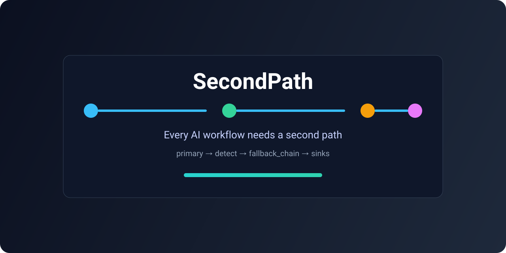

<p align="center">
  
</p>

<p align="center">
  <a href="https://github.com/markd88/secondpath/actions/workflows/ci.yml">
    
  </a>
  
  
  
</p>

# SecondPath

> Every AI workflow needs a second path.

SecondPath is a lightweight runtime layer for user-facing AI workflows.

It separates:
- AI/model optimization logic (best path)
- product fallback logic (delivery under failure)

In one line:

`primary -> detect -> fallback_chain -> sinks`

## Requirements

- Python `>=3.9`

## Install

```bash
pip3 install -e .
```

After PyPI release:

```bash
pip install secondpath
```

## Quick Start

```python
from secondpath import FallbackLayer, protect
from secondpath.detectors import EmptyResult, ExceptionType
from secondpath.sinks import StdoutSink


def primary(url: str, country: str) -> dict:
    if "timeout" in url:
        raise TimeoutError("crawl timed out")
    return {"headline": "", "image": None}


def text_only(url: str, country: str) -> dict:
    return {"headline": "Discover offers tailored to your market", "image": None}


plan = protect(
    primary=primary,
    detect=[
        EmptyResult("headline"),
        ExceptionType(TimeoutError, "timeout"),
    ],
    fallback_chain=[
        FallbackLayer.degraded_ai("text_only", text_only),
    ],
    sinks=[StdoutSink()],
)

result = plan.run(url="https://merchant.example", country="DE")
print(result.status, result.final_layer)
```

Possible statuses:
- `success`
- `degraded`
- `escalated`
- `failed`

## Examples

- `examples/website_creative.py`
  - canonical fallback-chain example (`success` / `degraded` / `escalated`)
- `examples/support_chatbot_queue.py`
  - chatbot + queue-backed human follow-up (`MessageQueueSink`)
- `examples/reuse_primary_output.py`
  - fallback reuses partial primary output through `context`
- `examples/react_agent_fallback.py`
  - primary execution unit can be a ReAct-style agent loop

Run any example:

```bash
python3 examples/website_creative.py
```

## Why this exists

Most teams optimize their AI path but leave product fallback scattered across business code.

SecondPath makes fallback explicit, composable, and observable without forcing a new workflow framework.

## Build in-house vs SecondPath

| Dimension | Build in-house | With SecondPath |
| --- | --- | --- |
| Initial flexibility | Maximum freedom for one team and one use case | Opinionated runtime contract (`primary -> detect -> fallback_chain -> sinks`) |
| Time to first reliable fallback | Fast for a single path, slower as edge cases grow | Fast start with reusable detectors, layers, and sinks |
| Cross-project consistency | Drifts across services and teams | Shared execution model and incident shape |
| Observability of failures | Usually ad hoc logs and custom payloads | Structured incidents + pluggable sinks |
| Error boundary discipline | Easy to mix model logic and product fallback logic | Clear separation between optimization path and delivery fallback |
| Maintenance cost over time | Grows with duplicated glue code | Centralized runtime behavior, tests, and examples |

If you only have one simple workflow, in-house may be enough. If you operate multiple user-facing AI paths, SecondPath helps standardize fallback behavior without introducing a full workflow platform.

## Core Concepts

- `protect(...)`: wrap one execution unit
- `primary`: preferred execution strategy (can be complex internally)
- `detect`: decide whether primary result is acceptable
- `fallback_chain`: ordered acceptable alternatives
- `sinks`: incident routing (stdout/webhook/slack/sqlite/mq)

Handler contract:
- `plan.run(*args, **kwargs)` inputs are forwarded to primary and fallback handlers
- handlers may optionally accept `context=` to read runtime info (`primary_output`, `primary_error`, `failure_type`, `artifacts`)

## Error Handling Policy

- Execution/runtime failures may degrade through fallback layers
- Configuration mistakes fail fast (`ConfigurationError`)
- Detector crashes fail fast (`DetectorError`)
- Sink errors are best effort and do not block main execution

## Scope (v0.1-alpha)

In scope:
- sync runtime (`protect(...)`)
- sequential fallback chains
- core detectors/sinks
- examples (including sink-backed human-review queue pattern)
- focused runtime/configuration/sink tests

Not in scope:
- workflow engine / graph runtime
- async-first orchestration
- full observability platform
- deep framework integrations

## Development

```bash
pip3 install -e .
python3 -m pytest
```

See also:
- `CONTRIBUTING.md`
- `ROADMAP.md`

## License

MIT
